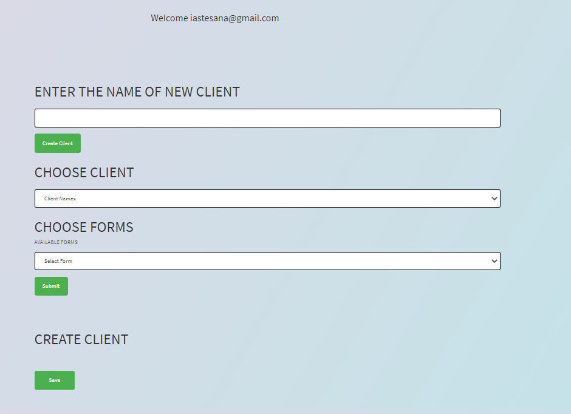

# JIAS's Form Generator

###### We created an online form filling applicaiton. The idea is that you can input data, and that data will render in the correct place on any pdf form. In this example, we have a 1040, and a DMV form.

## JIAS

# User Story
###### As a employee I need an application that assists with filling forms out
###### I need to be able to add data
###### so that I can render it in spacific places on any form pdf form.

### Profile: https://github.com/kaurshalpreet

1. License:
   MIT

1. Installation: 
   npm install

1. Usage: 
    Can only be used for non commercial purposes

1. Testing Methods: 
    Tested manually.

1. Contributors: 
    Ian N Astesana, Shalpreet Kaur, Audra Dagenais, Javier Alba

###### If you have any questions reach out to me by email. iastesana@gmail.com

